---
title       : Uma proposta para determinar o número de clusters
subtitle    : Trabalho de Conclusão de Curso
author      : Allan Vieira
job         : Orientador - Prof. Dr. André Cançado
framework   : io2012        # {io2012, html5slides, shower, dzslides, ...}
highlighter : highlight.js  # {highlight.js, prettify, highlight}
hitheme     : tomorrow      # 
widgets     : [mathjax, quiz, bootstrap, interactive] # {mathjax, quiz, bootstrap}
ext_widgets : #{rCharts: [libraries/nvd3, libraries/leaflet, libraries/dygraphs]}
mode        : selfcontained # {standalone, draft}
knit        : slidify::knit2slides
logo        : est_logo.png
biglogo     : unb_big_logo.png
assets      : {assets: ../../assets}
--- .class #id

## Sumário
 
 

1. Introdução

2. Metodologia

3. Algoritmo

4. Resultados

5. Conclusões

6. Referências

--- .class #id
## Introdução

> - .fragment **agrupar objetos/indivíduos/coisas** $\rightarrow$ inerente aos seres humanos:
 
> - .fragment 
  - .fragment 
 
 
> - .fragment Agrupamentos também são muito usados na Ciência:
  - .fragment Task View CRAN para a palavra **cluster**: $\pm$ 100 pacotes (jun. de 2018)
  - .fragment `hype` de Machine Learning
 
> - .fragment `Mas...`

--- .segue bg:grey
# O problema de estudo...

--- .class #id

 
 
 

- .fragment algoritmos $\rightarrow$ restrições:
  - .fragment "shape" dos dados `vs` algoritmo empregado
  - .fragment (...)
  - .fragment `definição a priori do número k de clusters`

 

- .fragment técnicas diferentes com o mesmo **k** $\rightarrow$ soluções diferentes para o mesmo conjunto de dados
  - .fragments `maioria dos algoritmos utilizam funções uniobjetivo` (Handl e Knowles, 2007)
 

--- .class #id
## Objetivo
 
 
> - Desenvolver um algoritmo para determinar o número de clusters utilizando uma função multiobjetivo;

> - .fragment `Mas...` "Não acho que quem ganhar ou quem perder, nem quem ganhar nem perder, vai ganhar ou perder. Vai todo mundo perder." (Dilma Roussef)

> - No Free Lunch Theorems

--- .segue bg:grey
# Metodologia ...

--- .class #id
## Descrição geral do método

 
 
> - aplicar uma técnica de clusterização `(MST)` nos dados reais para $k=1,2,...,n$ $\space$ clusters;
> - obter duas estatísticas de teste (conectividade e SSwt) para cada solução;
> - repetir o procedimento para dados simulados (hipercubos);
> - comparar as soluções obtidas em ambos os casos para definir o valor de $k$;
 
> - `ideia` $\rightarrow$ espera-se que soluções espúrias de agrupamentos nos dados apresentem valores de estatísticas de teste próximos aos das simulações.

--- .class #id
## Minimum Spanning Trees (MST)

<iframe src="./assets/widgets/MST_intlink_plotly.html" width="100%" height="100%" scrolling="no" seamless="seamless" frameBorder="0"> </iframe>

--- .class #id
## Hipercubos - Distribuição de Referência

inspiração: `Cubic Clustering Criterion (CCC)`

<iframe src="./assets/widgets/ccc_pca_plotly.html" width="100%" height="100%" scrolling="no" seamless="seamless" frameBorder="0"> </iframe>

--- .class #id
## Estatísticas de Teste - SS.wt
 
 

- Soma de quadrados total intra-cluster:
  $$SS.wt = \sum_{i=1}^{k}SSw_i,$$
  
  onde $SSw_i$ é a soma de quadrados dentro do cluster $i$.

--- .class #id
## Estatísticas de Teste - conn

- $N$: número de pontos no dataset; 
- $L$ (ou $n\_neig$): cardinalidade do conjunto de vizinhos mais próximos para avaliar conectividade; 
- $X$: matriz ordenada de distâncias euclidianas de tamanho $L \times N$; 
- $C_k$: cluster de rótulo $k$.

- Conectividade:
  $$conn = \sum_{i=1}^{N}\left(\sum_{j=1}^{L}x_{i,nn_{ij}}\right),$$
  
  $$x_{r,s} = \begin{cases} \frac{1}{j}, \; & \text{se} \; \nexists C_k: r \in C_k \land s \in C_k. \\ 0, & \text{caso  contrário}. \end{cases}$$

--- .class #id
## Otimalidade de Pareto - Função Multi-objetivo

<iframe src="./assets/widgets/pareto_plotly.html" width=50% height=55% allowtransparency="true"> </iframe>

--- .class #id
## Algoritmo (1)

<iframe src="./assets/widgets/algorit_plotly.html" width=50% height=55% allowtransparency="true"> </iframe>

--- .class #id
## Algoritmo (2)

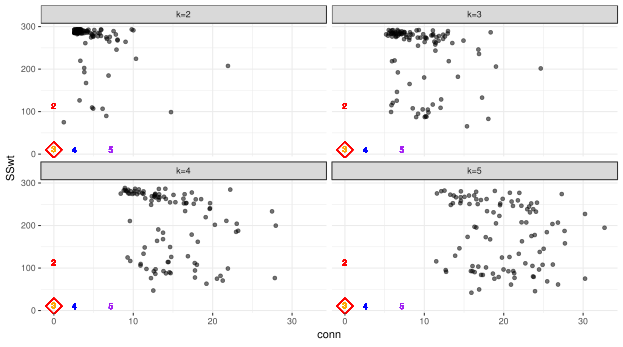

--- .segue bg:grey
# Uma demonstração ...

--- .segue bg:grey
# Alguns resultados ...

--- &twocol
## Resultados (1)

*** =left

<table class="table table-striped table-hover" style="font-size: 4px; width: auto !important; margin-left: auto; margin-right: auto;">
 <thead>
  <tr>
   <th style="text-align:left;"> id </th>
   <th style="text-align:left;"> type </th>
   <th style="text-align:left;"> dim </th>
   <th style="text-align:right;"> N </th>
   <th style="text-align:right;"> n_neig </th>
   <th style="text-align:right;"> n_sim </th>
   <th style="text-align:right;"> clust </th>
   <th style="text-align:left;"> result </th>
  </tr>
 </thead>
<tbody>
  <tr>
   <td style="text-align:left;"> 1 </td>
   <td style="text-align:left;"> elipse </td>
   <td style="text-align:left;"> 2d </td>
   <td style="text-align:right;"> 66 </td>
   <td style="text-align:right;"> 8 </td>
   <td style="text-align:right;"> 100 </td>
   <td style="text-align:right;"> 3 </td>
   <td style="text-align:left;"> k=3 </td>
  </tr>
  <tr>
   <td style="text-align:left;"> 2 </td>
   <td style="text-align:left;"> elipse </td>
   <td style="text-align:left;"> 2d </td>
   <td style="text-align:right;"> 236 </td>
   <td style="text-align:right;"> 8 </td>
   <td style="text-align:right;"> 400 </td>
   <td style="text-align:right;"> 2 </td>
   <td style="text-align:left;"> k=2 </td>
  </tr>
  <tr>
   <td style="text-align:left;"> 3 </td>
   <td style="text-align:left;"> elipse </td>
   <td style="text-align:left;"> 2d </td>
   <td style="text-align:right;"> 30 </td>
   <td style="text-align:right;"> 3 </td>
   <td style="text-align:right;"> 400 </td>
   <td style="text-align:right;"> 2 </td>
   <td style="text-align:left;"> k=2 </td>
  </tr>
  <tr>
   <td style="text-align:left;"> 4 </td>
   <td style="text-align:left;"> elipse </td>
   <td style="text-align:left;"> 2d </td>
   <td style="text-align:right;"> 100 </td>
   <td style="text-align:right;"> 8 </td>
   <td style="text-align:right;"> 100 </td>
   <td style="text-align:right;"> 2 </td>
   <td style="text-align:left;"> k=2 </td>
  </tr>
  <tr>
   <td style="text-align:left;"> 5a </td>
   <td style="text-align:left;"> elipse </td>
   <td style="text-align:left;"> 2d </td>
   <td style="text-align:right;"> 1050 </td>
   <td style="text-align:right;"> 8 </td>
   <td style="text-align:right;"> 100 </td>
   <td style="text-align:right;"> 2 </td>
   <td style="text-align:left;"> k=2 </td>
  </tr>
  <tr>
   <td style="text-align:left;"> 5b </td>
   <td style="text-align:left;"> elipse </td>
   <td style="text-align:left;"> 2d </td>
   <td style="text-align:right;"> 1050 </td>
   <td style="text-align:right;"> 3 </td>
   <td style="text-align:right;"> 400 </td>
   <td style="text-align:right;"> 2 </td>
   <td style="text-align:left;"> k=2 </td>
  </tr>
  <tr>
   <td style="text-align:left;"> 6 </td>
   <td style="text-align:left;"> elipse </td>
   <td style="text-align:left;"> 2d </td>
   <td style="text-align:right;"> 620 </td>
   <td style="text-align:right;"> 10 </td>
   <td style="text-align:right;"> 1000 </td>
   <td style="text-align:right;"> 3 </td>
   <td style="text-align:left;"> fail.MST </td>
  </tr>
  <tr>
   <td style="text-align:left;"> 7 </td>
   <td style="text-align:left;"> elipse </td>
   <td style="text-align:left;"> 2d </td>
   <td style="text-align:right;"> 750 </td>
   <td style="text-align:right;"> 25 </td>
   <td style="text-align:right;"> 100 </td>
   <td style="text-align:right;"> 3 </td>
   <td style="text-align:left;"> k=3 </td>
  </tr>
  <tr>
   <td style="text-align:left;"> 8 </td>
   <td style="text-align:left;"> elipse </td>
   <td style="text-align:left;"> 3d </td>
   <td style="text-align:right;"> 315 </td>
   <td style="text-align:right;"> 8 </td>
   <td style="text-align:right;"> 400 </td>
   <td style="text-align:right;"> 3 </td>
   <td style="text-align:left;"> k=3 </td>
  </tr>
  <tr>
   <td style="text-align:left;"> 9 </td>
   <td style="text-align:left;"> elipse </td>
   <td style="text-align:left;"> 3d </td>
   <td style="text-align:right;"> 520 </td>
   <td style="text-align:right;"> 7 </td>
   <td style="text-align:right;"> 400 </td>
   <td style="text-align:right;"> 4 </td>
   <td style="text-align:left;"> fail.MST </td>
  </tr>
  <tr>
   <td style="text-align:left;"> 10 </td>
   <td style="text-align:left;"> elipse </td>
   <td style="text-align:left;"> 3d </td>
   <td style="text-align:right;"> 633 </td>
   <td style="text-align:right;"> 7 </td>
   <td style="text-align:right;"> 400 </td>
   <td style="text-align:right;"> 4 </td>
   <td style="text-align:left;"> k=4 </td>
  </tr>
  <tr>
   <td style="text-align:left;"> 11a </td>
   <td style="text-align:left;"> elipse </td>
   <td style="text-align:left;"> 3d </td>
   <td style="text-align:right;"> 383 </td>
   <td style="text-align:right;"> 5 </td>
   <td style="text-align:right;"> 400 </td>
   <td style="text-align:right;"> 4 </td>
   <td style="text-align:left;"> k $\ge$ 6 </td>
  </tr>
  <tr>
   <td style="text-align:left;"> 11b </td>
   <td style="text-align:left;"> elipse </td>
   <td style="text-align:left;"> 3d </td>
   <td style="text-align:right;"> 383 </td>
   <td style="text-align:right;"> 5 </td>
   <td style="text-align:right;"> 1000 </td>
   <td style="text-align:right;"> 4 </td>
   <td style="text-align:left;"> k $\ge$ 6 </td>
  </tr>
  <tr>
   <td style="text-align:left;"> 11c </td>
   <td style="text-align:left;"> elipse </td>
   <td style="text-align:left;"> 3d </td>
   <td style="text-align:right;"> 383 </td>
   <td style="text-align:right;"> 7 </td>
   <td style="text-align:right;"> 1000 </td>
   <td style="text-align:right;"> 4 </td>
   <td style="text-align:left;"> k=4 </td>
  </tr>
</tbody>
</table>

*** =right

--- .class #id
## Resultados (2)
<table class="table table-striped table-hover" style="font-size: 4px; width: auto !important; margin-left: auto; margin-right: auto;">
 <thead>
  <tr>
   <th style="text-align:left;"> id </th>
   <th style="text-align:left;"> type </th>
   <th style="text-align:left;"> dim </th>
   <th style="text-align:right;"> N </th>
   <th style="text-align:right;"> n_neig </th>
   <th style="text-align:right;"> n_sim </th>
   <th style="text-align:right;"> clust </th>
   <th style="text-align:left;"> result </th>
  </tr>
 </thead>
<tbody>
  <tr>
   <td style="text-align:left;"> 12a </td>
   <td style="text-align:left;"> elipse </td>
   <td style="text-align:left;"> 10d </td>
   <td style="text-align:right;"> 838 </td>
   <td style="text-align:right;"> 3 </td>
   <td style="text-align:right;"> 400 </td>
   <td style="text-align:right;"> 4 </td>
   <td style="text-align:left;"> k $\ge$ 5 </td>
  </tr>
  <tr>
   <td style="text-align:left;"> 12b </td>
   <td style="text-align:left;"> elipse </td>
   <td style="text-align:left;"> 10d </td>
   <td style="text-align:right;"> 838 </td>
   <td style="text-align:right;"> 7 </td>
   <td style="text-align:right;"> 1000 </td>
   <td style="text-align:right;"> 4 </td>
   <td style="text-align:left;"> fail.MST </td>
  </tr>
  <tr>
   <td style="text-align:left;"> 12a </td>
   <td style="text-align:left;"> circ.+elip. </td>
   <td style="text-align:left;"> 2d </td>
   <td style="text-align:right;"> 550 </td>
   <td style="text-align:right;"> 7 </td>
   <td style="text-align:right;"> 1000 </td>
   <td style="text-align:right;"> 2 </td>
   <td style="text-align:left;"> k=4 </td>
  </tr>
  <tr>
   <td style="text-align:left;"> 12b </td>
   <td style="text-align:left;"> circ.+elip. </td>
   <td style="text-align:left;"> 2d </td>
   <td style="text-align:right;"> 550 </td>
   <td style="text-align:right;"> 25 </td>
   <td style="text-align:right;"> 1000 </td>
   <td style="text-align:right;"> 2 </td>
   <td style="text-align:left;"> k=4 </td>
  </tr>
  <tr>
   <td style="text-align:left;"> 14a </td>
   <td style="text-align:left;"> circ.+elip. </td>
   <td style="text-align:left;"> 2d </td>
   <td style="text-align:right;"> 1000 </td>
   <td style="text-align:right;"> 25 </td>
   <td style="text-align:right;"> 400 </td>
   <td style="text-align:right;"> 4 </td>
   <td style="text-align:left;"> k $\ge$ 5 </td>
  </tr>
  <tr>
   <td style="text-align:left;"> 14b </td>
   <td style="text-align:left;"> circ.+elip. </td>
   <td style="text-align:left;"> 2d </td>
   <td style="text-align:right;"> 1000 </td>
   <td style="text-align:right;"> 10 </td>
   <td style="text-align:right;"> 1000 </td>
   <td style="text-align:right;"> 4 </td>
   <td style="text-align:left;"> k=5 </td>
  </tr>
  <tr>
   <td style="text-align:left;"> 15a </td>
   <td style="text-align:left;"> espiral </td>
   <td style="text-align:left;"> 2d </td>
   <td style="text-align:right;"> 1000 </td>
   <td style="text-align:right;"> 7 </td>
   <td style="text-align:right;"> 400 </td>
   <td style="text-align:right;"> 3 </td>
   <td style="text-align:left;"> k=4 </td>
  </tr>
  <tr>
   <td style="text-align:left;"> 15b </td>
   <td style="text-align:left;"> espiral </td>
   <td style="text-align:left;"> 2d </td>
   <td style="text-align:right;"> 300 </td>
   <td style="text-align:right;"> 20 </td>
   <td style="text-align:right;"> 300 </td>
   <td style="text-align:right;"> 3 </td>
   <td style="text-align:left;"> k=2 </td>
  </tr>
  <tr>
   <td style="text-align:left;"> 15c </td>
   <td style="text-align:left;"> espiral </td>
   <td style="text-align:left;"> 2d </td>
   <td style="text-align:right;"> 300 </td>
   <td style="text-align:right;"> 15 </td>
   <td style="text-align:right;"> 300 </td>
   <td style="text-align:right;"> 3 </td>
   <td style="text-align:left;"> k=3 </td>
  </tr>
  <tr>
   <td style="text-align:left;"> 15d </td>
   <td style="text-align:left;"> espiral </td>
   <td style="text-align:left;"> 2d </td>
   <td style="text-align:right;"> 300 </td>
   <td style="text-align:right;"> 15 </td>
   <td style="text-align:right;"> 1000 </td>
   <td style="text-align:right;"> 3 </td>
   <td style="text-align:left;"> k=3 </td>
  </tr>
  <tr>
   <td style="text-align:left;"> 16 </td>
   <td style="text-align:left;"> espiral </td>
   <td style="text-align:left;"> 2d </td>
   <td style="text-align:right;"> 300 </td>
   <td style="text-align:right;"> 20 </td>
   <td style="text-align:right;"> 300 </td>
   <td style="text-align:right;"> 3 </td>
   <td style="text-align:left;"> k=2 </td>
  </tr>
  <tr>
   <td style="text-align:left;"> 17 </td>
   <td style="text-align:left;"> alongado </td>
   <td style="text-align:left;"> 2d </td>
   <td style="text-align:right;"> 300 </td>
   <td style="text-align:right;"> 30 </td>
   <td style="text-align:right;"> 300 </td>
   <td style="text-align:right;"> 4 </td>
   <td style="text-align:left;"> k=4 </td>
  </tr>
  <tr>
   <td style="text-align:left;"> 18 </td>
   <td style="text-align:left;"> along.+elip. </td>
   <td style="text-align:left;"> 2d </td>
   <td style="text-align:right;"> 750 </td>
   <td style="text-align:right;"> 25 </td>
   <td style="text-align:right;"> 100 </td>
   <td style="text-align:right;"> 3 </td>
   <td style="text-align:left;"> k=3 </td>
  </tr>
</tbody>
</table>

--- .class #id
## Resultados (3)

<!-- sol para imagens lado a lado: https://owlcation.com/stem/how-to-align-images-side-by-side -->

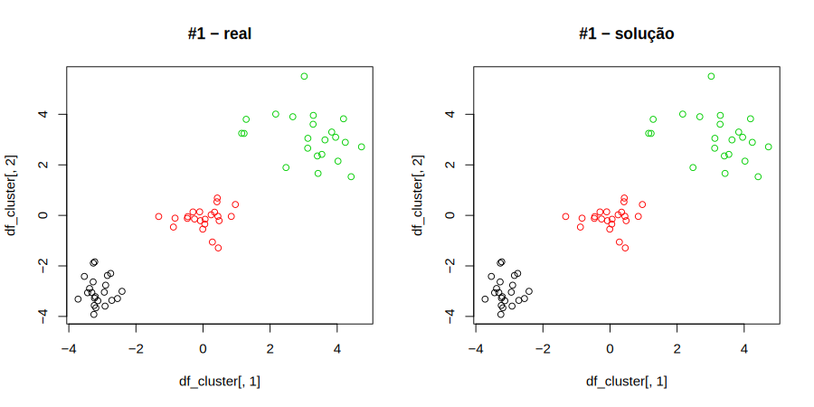

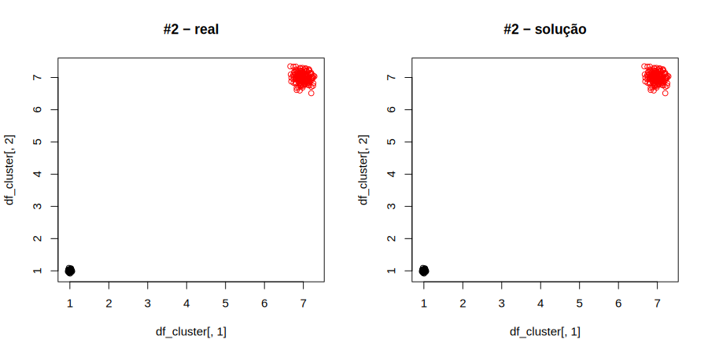

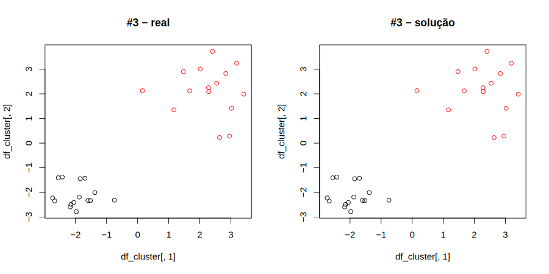

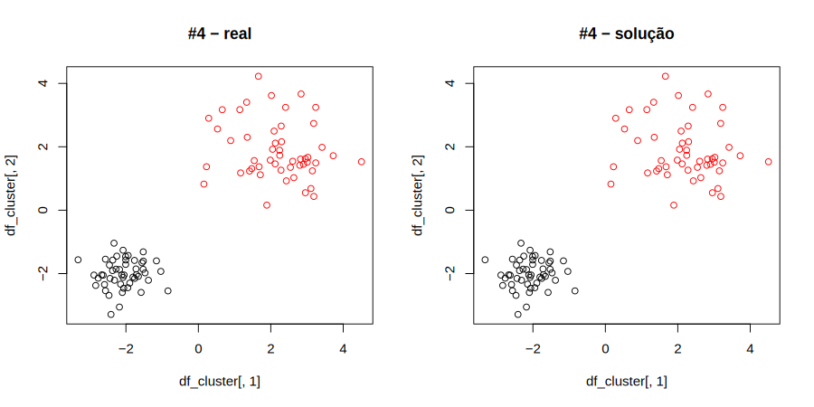

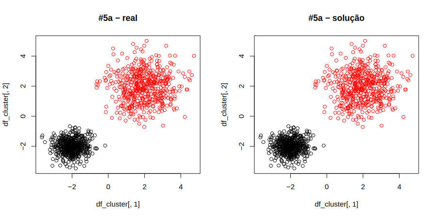

--- .class #id
## Resultados (4)

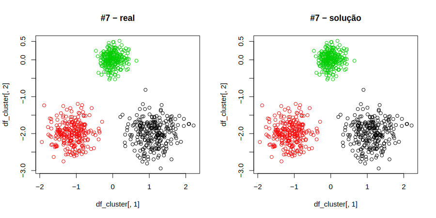

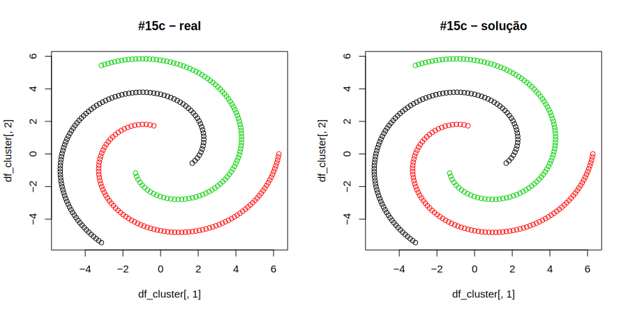

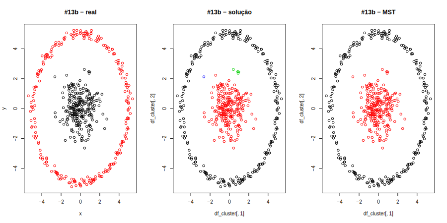

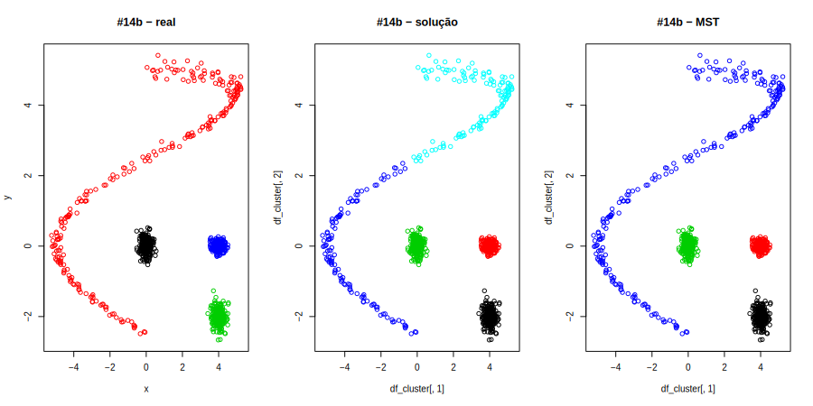

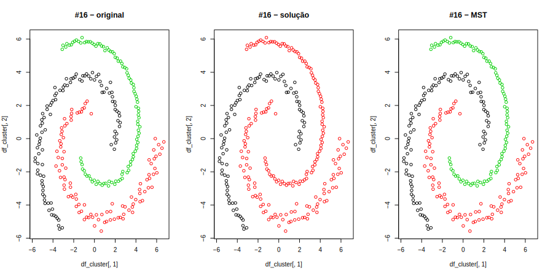

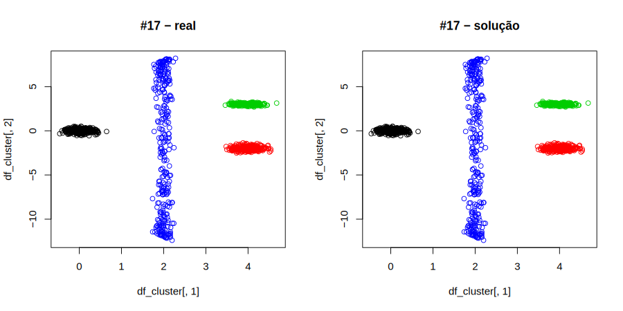

--- .class #id
## Resultados (5)

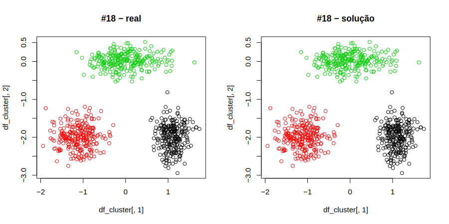

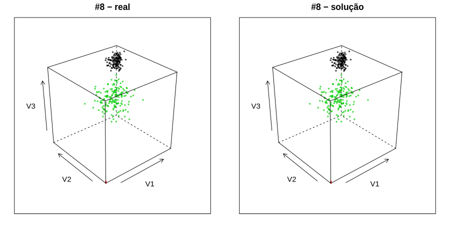

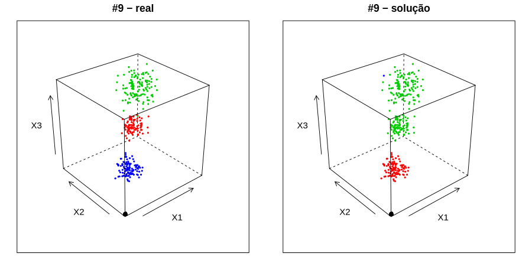

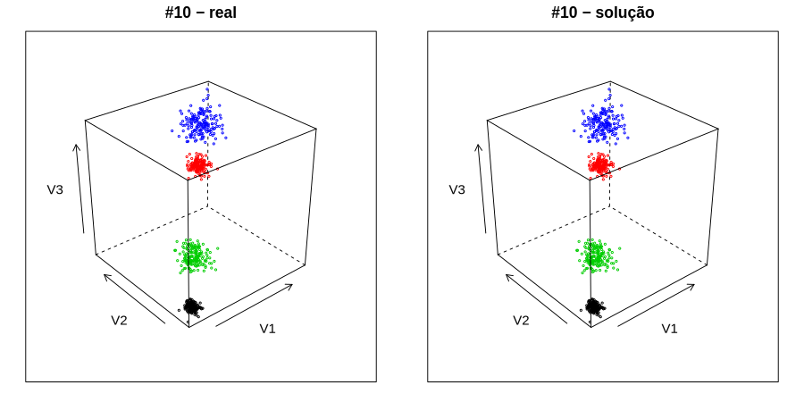

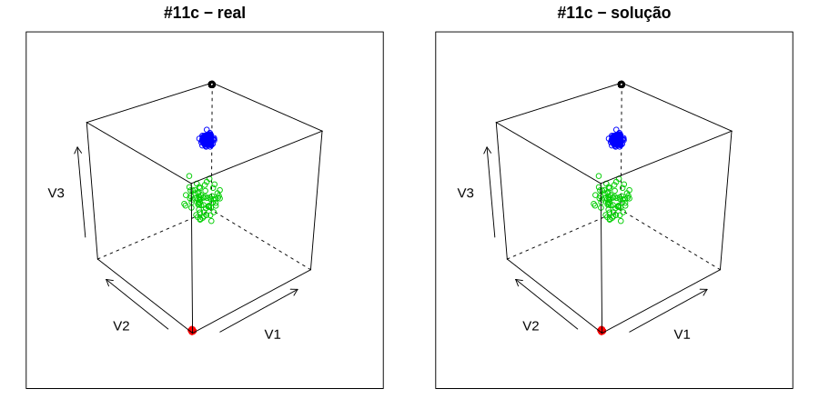

--- .class #id
## Conclusões

> - .fragment `MST:`
  - .fragment bom desempenho do algoritmo MST based clustering
  - .fragment `resolver problemas com outliers`

> - .fragment `Algoritmo geral:`
  - .fragment dificuldades em dados com grupos circulares (herda do ccc) e com outliers (herda do MST)
  - .fragment especificar `n_neig` é uma restrição
  - .fragment bom funcionamento no geral
  
> - .fragment `Para estudos futuros:`
  - .fragment aprimorar os algoritmos e implementar pacotes

--- .class #id
## Referências

- CURTIN, R. R. et al. `Mlpack: A scalable C++ machine learning library`. Journal of Machine Learning Research , v. 14, 2013.

- EVERITT, B. S. et al. `Cluster Analysis`. 5th edition. ed. [S.l.: s.n.], 2011.

- HANDL, J.; KNOWLES, J. `An evolutionary approach to objective clustering.` IEEE Transactions on Evolutionary Computation, v. 11, n. 1, Feb 2007. 2

- MARCH, W. B.; RAM, P.; GRAY, A. G. `Fast euclidian minimum spanning tree: algorithm analysis, and applications`. 16th ACM SIGKDD international conference on Knowledge discovery and data mining , July 25-28 2010. Washington, DC, USA.

- SARLE, W. S. `Cubic Clustering Criterion`. [S.l.], 1983. v. 46, n. A-108. Cary, NC.: SAS Institute, 1983, 56 pp.

--- .segue bg:grey

# Obrigado!!

<!-- como colocar figuras ao lado de palavras varias vezes em html -->

    
Feito no
     com 
    ,
     e
     !! 

Códigos e apresentação disponíveis noem:
 

<a href="http://github.com/allanvc/" style="color:black">http://github.com/allanvc/</a>

<a href="http://allanvc.github.io/apres_TCC2/" style="color:black">http://allanvc.github.io/apres_TCC2/</a>

